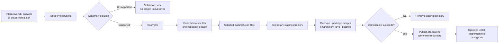

# Praxis configuration-to-project summary

In Praxis terminology, `praxis.config.json` is the **intent record**. It describes what the user wants; it is not the generated source code and it does not identify a Git template branch.

## The production chain

Interactive answers and `--config praxis.config.json` both produce a `PraxisConfig`:

```text
User answers or JSON
→ validated PraxisConfig
→ ordered module IDs
→ selected manifests
→ staged composition
→ standalone generated repository
```



### 1. Configuration and validation

The CLI converts the questionnaire answers into a typed configuration. The schema validates project type, framework, language, database, authentication, cache, deployment, and Pro capability selections before generation continues.

For example, a fullstack request can select Next.js, Express, PostgreSQL, self-hosted auth, Redis, and Docker. An unsupported combination fails here with a validation error instead of producing a partial project.

### 2. Resolution

`resolver.ts` converts the validated configuration into an ordered list of module IDs:

```text
base.workspace
frontend.next
styling.tailwind-shadcn
backend.express
database.postgres
auth.self-hosted
cache.redis
deployment.docker
```

The order is required for more than Docker Compose and deployment:

- **Prerequisites before dependants:** `background-jobs` requires Redis, so the resolved set places `pro.capability.redis-cache` before `pro.capability.background-jobs`. Redis files, packages, and environment keys exist before the worker integration is patched in.
- **Base files before patches:** `pro.core` and `pro.django` are composed before a capability patch targets `manage.py`, Django settings, or URL configuration. A patch cannot target a file that has not been created yet.
- **Capability closure in dependency order:** requesting Terraform can resolve Kubernetes and cloud-secrets prerequisites before `pro.terraform.shared` and the selected cloud module. The generated infrastructure therefore refers to capabilities that already exist in the effective configuration.
- **Deterministic conflicts:** a base module creates a file first; a later module may only replace it when its manifest explicitly declares `replace: true`. Otherwise composition fails instead of silently choosing a winner.
- **Shared infrastructure selection:** Compose, Kubernetes, and Terraform consume the same resolved capabilities. A Redis selection therefore contributes the matching application wiring and only the corresponding infrastructure resources.

### 3. Manifest-driven composition

The composer loads each module's `manifest.json` and applies its declarations in resolver order:

- **Overlays** copy framework-native source files into the selected output scope.
- **Package contributions** merge dependencies and scripts into the appropriate `package.json`.
- **Environment contributions** add the required keys to `.env.example`.
- **Patches** make narrowly scoped integrations at named anchors in existing files.

Composition happens in a temporary staging directory. Praxis publishes the destination only after every overlay, package merge, environment contribution, and patch succeeds. If a patch anchor is missing or an undeclared file conflict occurs, the staging directory is removed and no incomplete project is published.

### 4. Provenance and post-generation steps

The generated repository receives the effective `praxis.config.json`, preserving the choices and resolved capability set that produced it. The repository is standalone; it does not require Praxis at runtime.

Only after composition does Praxis optionally contact external systems by installing dependencies with the selected package manager and running `git init`. Those steps are separate from template selection and do not fetch generated files from Git.

The key distinction is simple: configuration selects and assembles maintained implementation modules; the modules and their manifests produce the project.
