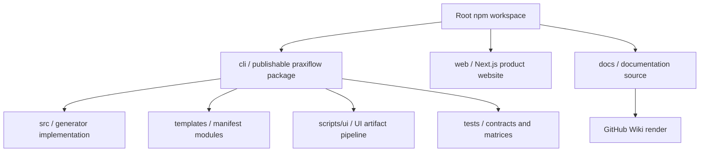
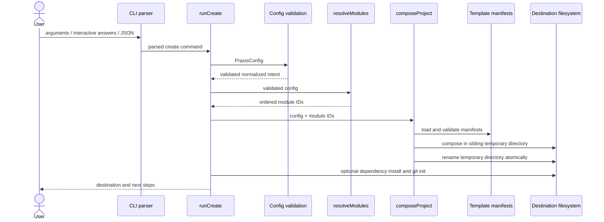
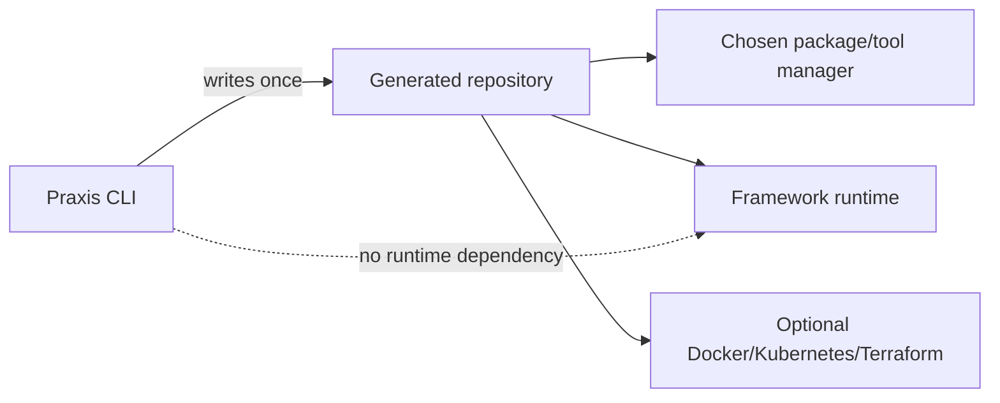

# Praxis system architecture

## Repository boundaries

The root workspace supplies shared commands and CI. `cli/` owns all code shipped to npm. `web/` is independently built and deployed. `docs/` describes both but is not included in the CLI package.

## Generation architecture

## Architectural layers

| Layer | Responsibility | Must not do |
| --- | --- | --- |
| CLI parsing | Convert argv into a typed command | Resolve template files |
| Workflow | Ask questions and coordinate generation | Encode manifest file paths |
| Configuration | Validate supported intent and compatibility | Perform filesystem writes |
| Resolver | Choose an ordered module list | Copy or patch files |
| Manifest model | Describe conditional contributions | Execute arbitrary code from manifests |
| Composer | Apply selected declarations safely | Decide product policy |
| Post-generation | Install dependencies and initialize Git when requested | Change the validated selection |
| UI tooling | Author and verify generated UI modules/previews | Run in generated applications |

## Trust and safety boundaries

- Configuration files are untrusted input and are validated before module resolution.
- Module identifiers must match a restricted pattern, and resolved paths are confined to their module or output root.
- Manifests are bundled, trusted product data; they are declarative and cannot invoke shell commands.
- Generation uses a sibling staging directory. Any composition error removes staging and leaves the destination absent.
- Existing destinations are rejected; Praxis does not merge into or overwrite an application directory.
- Package installation and Git initialization happen only after source composition and only when explicitly configured.
- The local UI gallery binds to `127.0.0.1`, serves bundled assets from an allowlist, and falls back to terminal selection.

## Generated-system boundaries

After generation, the output owns its runtime:

The [Generated backends](generated-backends.md) page describes the internal runtime topology of each backend family.

## Current versus future

Everything above describes current code. Potential future additions—new stacks, richer manifest operations, hosted galleries, or remote template registries—must not be inferred from the generic abstractions. They require explicit schema, resolver, composition, tests, and documentation changes.

