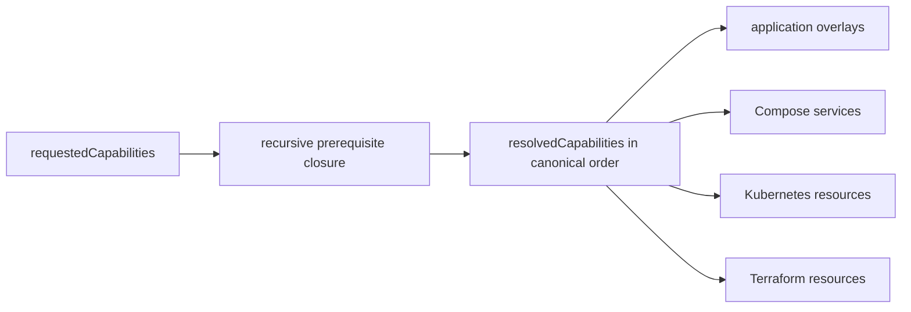

# Praxis Pro capability architecture

Praxis Pro capabilities express operational outcomes independent of stack. `resolveProCapabilities()` expands prerequisites and returns canonical order; stack selectors then choose Django or Go implementations.

## Requested versus resolved

The schema recomputes closure and rejects stale/forged `resolvedCapabilities`. Important implications include fine-grained auth → JWT, background jobs → Redis, scheduled/email jobs → background jobs, realtime → Redis, synthetic monitoring → Prometheus, and Terraform → Kubernetes plus cloud-operational prerequisites.

## Capability families

| Family | Capabilities | Typical output layers |
| --- | --- | --- |
| Identity/policy | JWT, social auth, fine-grained auth | middleware, domain policy, migrations/config |
| Data/integration | Redis, storage, search, Kafka, realtime, flags | clients, services, Compose/K8s/cloud resources |
| Work execution | background, scheduled, email tasks | worker/scheduler commands and services |
| Observability | Sentry, Prometheus, OpenTelemetry, ELK, synthetic monitoring | middleware/exporters/collectors/config |
| Quality/governance | seed data, load testing, compliance audit | tools, jobs, audit code |
| Traffic/resilience | Nginx, autoscaling, HA, edge protection, DB resilience, disaster recovery, cloud secrets | Compose/K8s/Terraform policy/resources |

## Composition rule

Capability modules may contribute framework-specific overlays, shared files, packages, environment keys, and patches. Selectors apply to every contribution. Patch anchors retained in replacement text allow later capabilities to extend the same entry point deterministically.

## Runtime rule

An enabled capability must be executable, not merely documented: its dependencies are constructed, readiness/lifecycle is owned, the relevant process/resource is present, and tests prove the contract. A capability may cross application, Compose, Kubernetes, and Terraform layers, but each layer has separate lifecycle ownership.

## Authoritative sources and tests

- Capability list/closure: [`cli/src/config/pro.ts`](../cli/src/config/pro.ts)
- Validation: [`cli/src/config/schema.ts`](../cli/src/config/schema.ts)
- Modules: [`cli/templates/pro.capability.jwt-auth/`](../cli/templates/pro.capability.jwt-auth/)
- Contracts: [`cli/tests/generator/proCapabilities.test.ts`](../cli/tests/generator/proCapabilities.test.ts), [`proMatrix.test.ts`](../cli/tests/generator/proMatrix.test.ts)
