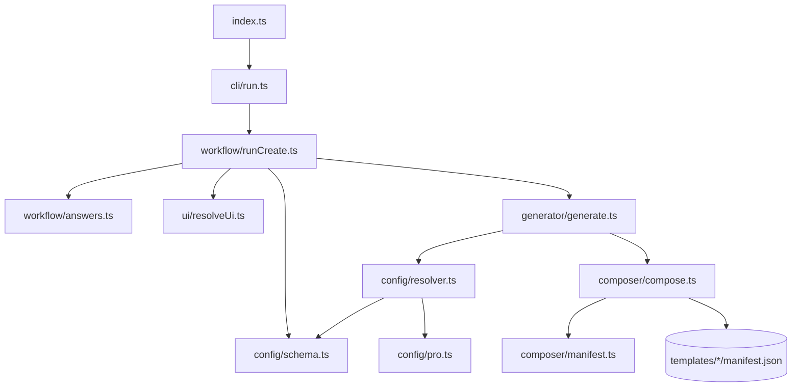

# Code-level architecture

Praxis favors functions and discriminated unions over a class hierarchy. The important abstractions are typed boundaries: parsed commands, configuration variants, module manifests, selectors, and injected workflow dependencies. Legacy installer classes remain in `cli/src/utils/`, but the canonical generation path is the manifest-driven pipeline described here.

## Dependency direction

Lower layers do not import the interactive workflow. The composer knows how to apply modules but not why a module was selected. The resolver knows selection policy but not filesystem implementation.

## Core types and abstractions

### `ParsedCommand`

Defined in [`cli/src/cli/command.ts`](../cli/src/cli/command.ts), this discriminated union separates help and create behavior. Create commands carry mode (`custom`, `quick`, or `config`), optional project/config paths, and dependency-install intent.

### `PraxisConfig`

Defined in [`cli/src/config/schema.ts`](../cli/src/config/schema.ts), it is a union of:

- standard schema-version-1 configuration for frontend/backend/fullstack;
- schema-version-2 `ProPraxisConfig` for `pro-backend`.

Validation rejects unknown keys and unsupported combinations before resolution. Schema migration keeps older version-1 cache-less configurations compatible by normalizing them to `cache: "none"`.

### `ProConfig` and capability closure

[`cli/src/config/pro.ts`](../cli/src/config/pro.ts) owns the canonical capability order and implication graph. `resolveProCapabilities()` recursively adds prerequisites, deduplicates them, and returns canonical order. Validation recomputes the closure and rejects forged or stale `resolvedCapabilities`.

### `TemplateManifest`

[`cli/src/composer/manifest.ts`](../cli/src/composer/manifest.ts) defines four contribution types:

- `OverlayDefinition`
- `PackageContribution`
- `EnvironmentContribution`
- `PatchDefinition`

Each extends the same optional selector vocabulary. This keeps conditional behavior declarative and testable.

### `CreateDependencies`

[`cli/src/workflow/runCreate.ts`](../cli/src/workflow/runCreate.ts) injects splash, configuration resolution, and generation functions into `runCreate`. Tests can verify orchestration without performing real filesystem generation or animation.

## Responsibilities by function

| Function | Input | Output / effect |
| --- | --- | --- |
| `parseCommand` | argv | `ParsedCommand` |
| `runCli` | `ParsedCommand` | Routes help/create |
| `runCreate` | create command | Coordinates prompt, spinner, generation, next steps |
| `answersToConfig` | standard answers | Validated standard config |
| `proAnswersToConfig` | Pro answers | Requested/resolved Pro config |
| `validateConfig` | unknown value | Narrowed `PraxisConfig` or error |
| `resolveModules` | validated config | Ordered module IDs |
| `composeProject` | config, modules, paths | Atomically materialized source tree |
| `generateProject` | config, cwd | Destination path after optional install/Git init |
| `resolveUiStyle` | gallery/terminal interaction | Canonical UI style ID |

## Extension recipe

Adding a new standard option normally requires coordinated changes to:

1. schema types and validation;
2. interactive answers and configuration conversion;
3. resolver module selection;
4. one or more manifests and source overlays;
5. generation and package-content tests;
6. documentation.

Adding a Pro capability also requires registering it in canonical order, defining implications if any, implementing both stack variants or explicitly stack-selecting contributions, and extending Compose/Kubernetes/Terraform wiring when the capability has infrastructure.

## Legacy boundary

Files under `cli/src/prompts/`, `cli/src/utils/`, `cli/src/controllers/`, and `cli/src/legacy/` include code retained for compatibility or shared presentation helpers. New generation behavior should enter through the configuration/resolver/manifest pipeline, not through branch matrices or repository-cloning installer classes.

