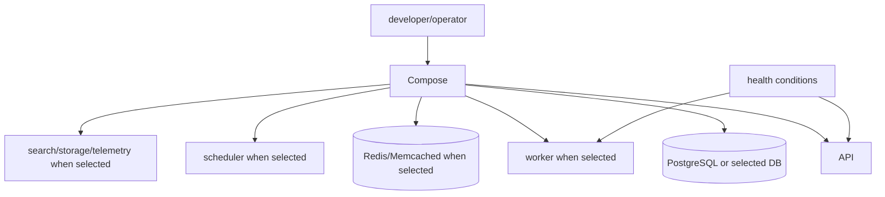

# Docker Compose architecture

Docker Compose is the local production-shape topology. Standard projects receive it only when Docker is selected; Praxis Pro always includes `pro.compose` after stack/capability modules.

## Standard topology

`deployment.docker` selects root/frontend/backend artifacts by project type and patches selected database/cache services and internal URLs. The backend still performs readiness checks and graceful cleanup.

## Praxis Pro topology

`pro.compose` starts from a Django or Go base. Capability overlays add only required services and commands: Redis before jobs, workers before scheduled/email work, and selected search/storage/telemetry services. Health-conditioned dependencies model readiness; `depends_on` alone is not treated as application readiness.

## Ownership boundaries

- Compose owns containers, networks, volumes, environment injection, restart policy, and dependency conditions.
- Application processes own schema/migration semantics, request behavior, client lifecycle, and graceful shutdown.
- Kubernetes is a separate deployment model, not generated from Compose at runtime.
- Terraform provisions cloud foundations and managed services; it does not invoke Compose.

## Safe extension

Add a service only when a resolved selection requires it. Give stateful dependencies health checks and persistent volumes where appropriate. Use internal service names in container URLs and documented developer values in `.env.example`. Keep secrets external to committed Compose files.

## Authoritative sources and tests

- Standard: [`cli/templates/deployment.docker/`](../cli/templates/deployment.docker/)
- Pro: [`cli/templates/pro.compose/`](../cli/templates/pro.compose/)
- Matrix: [`cli/tests/generator/matrix.test.ts`](../cli/tests/generator/matrix.test.ts), [`proMatrix.test.ts`](../cli/tests/generator/proMatrix.test.ts)
