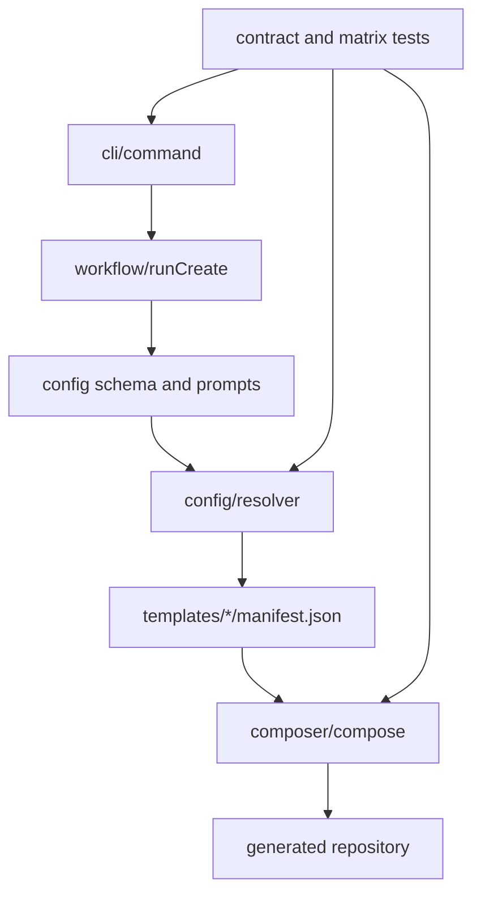

# Praxis Core Internals

Core Internals documents the code that interprets intent and writes repositories. It does not describe the generated application's runtime except where that boundary is necessary to explain composition.

## Reading order

1. [System architecture](architecture.md) for repository and trust boundaries.
2. [Repository map](repository-map.md) for ownership.
3. [Code architecture](code-architecture.md) for typed abstractions and dependency direction.
4. [Generation pipeline](generation-pipeline.md) for execution order and failure behavior.
5. [Manifest system](manifest-system.md) for overlays, selectors, packages, environment, and patches.
6. [UI templates](ui-templates.md) for the separately generated visual-template artifacts.
7. [Testing](testing.md) for evidence requirements.

## Core invariants

- Configuration is validated before module resolution.
- Module order is deterministic.
- Manifest paths cannot escape approved template or staging roots.
- Composition writes to a sibling staging directory and never leaves a partial destination.
- Package/script conflicts fail rather than silently selecting a winner.
- Generated outputs do not import Praxis at runtime.
- Requested and resolved Pro capabilities remain separately recorded.

## Authoritative entry points

- CLI parser: [`cli/src/cli/command.ts`](../cli/src/cli/command.ts)
- Workflow: [`cli/src/workflow/runCreate.ts`](../cli/src/workflow/runCreate.ts)
- Schema: [`cli/src/config/schema.ts`](../cli/src/config/schema.ts)
- Resolver: [`cli/src/config/resolver.ts`](../cli/src/config/resolver.ts)
- Pro closure: [`cli/src/config/pro.ts`](../cli/src/config/pro.ts)
- Composer: [`cli/src/composer/compose.ts`](../cli/src/composer/compose.ts)
- Manifest types: [`cli/src/composer/manifest.ts`](../cli/src/composer/manifest.ts)

For generated runtime behavior, continue to [Praxis Template Architecture](template-architecture.md).
