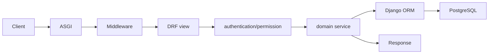

# Django and DRF Praxis Pro architecture

The Django stack uses framework-driven object-oriented patterns: settings modules configure installed applications and middleware; DRF views/serializers handle HTTP; models and service functions/classes own domain and persistence work; optional Celery processes execute asynchronous work.

## Generated directory map

```text
manage.py
pyproject.toml
config/
  asgi.py
  urls.py
  settings/{base,development,production,test}.py
core/
  apps.py
  urls.py
  views.py
  middleware.py
  errors.py
  ...selected capability modules
tests/
Dockerfile
docker-compose.yml
k8s/                 # when selected
infra/terraform/     # when selected
```

## Runtime entry points

`config.asgi` is the production application entry point, typically served by Uvicorn. `manage.py` owns administration and migrations. `config.urls` delegates API/health routes to generated applications. Celery worker/beat entry points appear only when the resolved capabilities require them.

## Request lifecycle



Middleware establishes request context, logging, telemetry, and selected cross-cutting behavior. Authentication creates a principal; permissions/policies evaluate access; the view validates transport input and delegates domain work. Django transaction semantics commit or roll back ORM work.

## Dependency wiring

Settings and Django's application registry provide framework wiring. Praxis capability manifests patch installed apps, middleware, URL configuration, and environment settings, then overlay capability-specific modules. Background/scheduled/email work uses Celery with Redis; this dependency is encoded in resolved capability closure and Compose/Kubernetes services.

## Startup, readiness, and shutdown

Container startup applies framework checks/migration policy before serving as defined by generated scripts. Liveness indicates process health; readiness includes database and selected dependency reachability. ASGI servers drain requests on termination; Celery workers receive their own termination lifecycle. Kubernetes and Compose declare service-specific probes/dependencies rather than treating one process as the entire system.

## Capability integration

JWT and fine-grained authorization integrate with DRF authentication/permission boundaries. Redis supports cache, realtime, and Celery prerequisites. Object storage, search, Kafka, flags, telemetry, logging, compliance, and operational capabilities add focused configuration/modules. Requested capabilities are not used directly at runtime; generated code reflects the verified resolved set.

## Infrastructure relationship

Compose runs API, PostgreSQL, and only the workers/services required by resolved capabilities. Kubernetes emits separate Deployments/Jobs and configuration for API, worker, scheduler, migrations, and dependencies. Terraform provisions selected cloud foundations/managed services but does not run Django migrations or deploy application manifests by itself.

## Extension points

Create bounded Django applications or focused `core` modules, keep views transport-oriented, keep domain policy outside settings, use migrations for schema changes, and preserve environment separation. Template changes must patch named anchors and update stack/runtime/Compose/Kubernetes contracts together when a capability crosses those layers.

## Authoritative sources and tests

- Stack: [`cli/templates/pro.django/`](../cli/templates/pro.django/)
- Core: [`cli/templates/pro.core/`](../cli/templates/pro.core/)
- Capabilities: [`cli/templates/pro.capability.jwt-auth/`](../cli/templates/pro.capability.jwt-auth/), [`pro.capability.background-jobs/`](../cli/templates/pro.capability.background-jobs/)
- Runtime contracts: [`cli/tests/generator/proRuntime.test.ts`](../cli/tests/generator/proRuntime.test.ts)
- Capability contracts: [`cli/tests/generator/proCapabilities.test.ts`](../cli/tests/generator/proCapabilities.test.ts)
