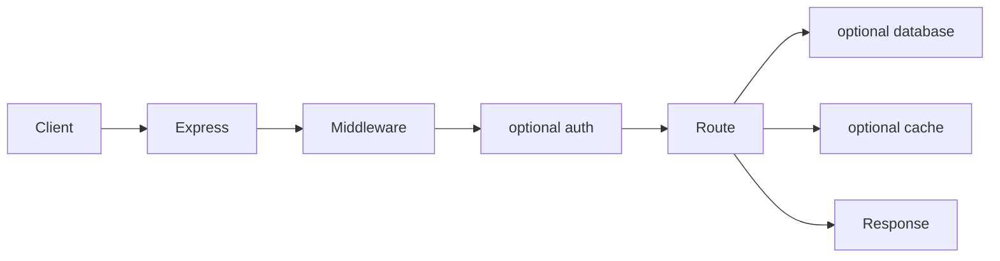

# Express backend architecture

The Standard backend is a small framework-native Express service. Its architecture is functional module composition: a base server exposes stable anchors, and selected database, authentication, cache, and deployment manifests contribute imports, routes, startup tasks, and shutdown tasks.

## Generated directory map

```text
package.json
.env.example
src/
  server.ts|js
  lib/
    shutdown.ts|js
    database.*       # when selected
    cache.*          # when selected
  auth/              # when selected
prisma/              # PostgreSQL/Mongo Prisma modules when selected
Dockerfile           # Docker deployment when selected
```

Exact optional paths come from module manifests. Inspect the resolved modules rather than assuming all directories exist.

## Runtime entry points

`src/server.ts` or `src/server.js` creates the Express app, registers middleware and routes, executes startup tasks, listens, and installs signal handling. `src/lib/shutdown.*` owns the memoized shutdown controller.

## Request lifecycle



The base `/health` route proves process liveness. Integration modules may add real example routes and readiness behavior. Errors are forwarded through Express rather than being swallowed by route promises.

## Dependency wiring

The manifest composer patches stable anchors in the base server. Database and cache modules import client helpers, append readiness work to startup tasks, add example routes, and register disconnect functions only after successful initialization. Authentication modules add provider-specific middleware or protected routes. There is no runtime plugin loader: the generated source directly imports the selected integrations.

## Startup, readiness, and shutdown

Startup loads environment variables before constructing clients, runs dependency readiness before listening, and rolls back initialized resources when startup fails. Shutdown is globally memoized: it first stops accepting/drains HTTP traffic, then settles dependency cleanup. Redis and Memcached readiness failures close their clients before rethrowing.

## Capability integration

Standard projects call these choices database/auth/cache modules rather than Pro capabilities:

- PostgreSQL or MongoDB contributes Prisma configuration/client lifecycle.
- Self-hosted auth depends on a selected database; Clerk and Supabase are external identity providers.
- Redis or Memcached contributes an async client, readiness check, cache route, and disconnect hook.
- `none` contributes no integration code or dependency.

## Infrastructure relationship

Docker deployment builds the service and adds selected database/cache services with internal URLs. The application still owns migrations and dependency readiness; Compose controls container ordering and health conditions, not domain behavior. Standard Express does not generate Kubernetes or Terraform.

## Extension points

Add application routes and services as ordinary Express modules. When extending Praxis templates, preserve base anchors, use selectors for language/project type, contribute packages/env through manifests, make startup rollback-safe, and register idempotent cleanup. Do not patch generated files by position or scan the output to rediscover configuration.

## Authoritative sources and tests

- Base: [`cli/templates/backend.express/`](../cli/templates/backend.express/)
- Integrations: [`database.postgres/`](../cli/templates/database.postgres/), [`database.mongo/`](../cli/templates/database.mongo/), [`auth.self-hosted/`](../cli/templates/auth.self-hosted/), [`cache.redis/`](../cli/templates/cache.redis/), [`cache.memcached/`](../cli/templates/cache.memcached/)
- Lifecycle contracts: [`cli/tests/generator/lifecycle.test.ts`](../cli/tests/generator/lifecycle.test.ts)
- Composition matrix: [`cli/tests/generator/matrix.test.ts`](../cli/tests/generator/matrix.test.ts)
