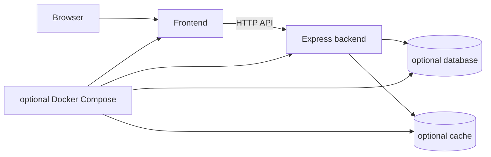

# Standard fullstack architecture

A Standard fullstack output is a workspace containing independent frontend and Express backend packages.

```text
package.json
praxis.config.json
frontend/
  package.json
  ...framework-native source
backend/
  package.json
  src/server.ts|js
  ...selected integrations
docker-compose.yml   # when Docker is selected
```

`base.workspace` establishes package boundaries and root scripts. Manifest scope mapping sends frontend contributions to `frontend/`, backend contributions to `backend/`, and shared deployment artifacts to the root.



The packages do not import each other's source. Environment configuration defines the API boundary. Local root scripts coordinate package-manager workspaces, while each package retains its own build/runtime scripts.

## Extension rules

- Put browser code and public environment variables under `frontend/`.
- Put secrets, persistence, auth middleware, and cache clients under `backend/`.
- Keep cross-boundary contracts explicit through HTTP schemas rather than shared runtime imports.
- If Docker is selected, update health/dependency behavior together with application lifecycle behavior.

## Authoritative sources and tests

- Workspace module: [`cli/templates/base.workspace/`](../cli/templates/base.workspace/)
- Resolver scope: [`cli/src/config/resolver.ts`](../cli/src/config/resolver.ts)
- Composer scope mapping: [`cli/src/composer/compose.ts`](../cli/src/composer/compose.ts)
- Matrix tests: [`cli/tests/generator/matrix.test.ts`](../cli/tests/generator/matrix.test.ts)
