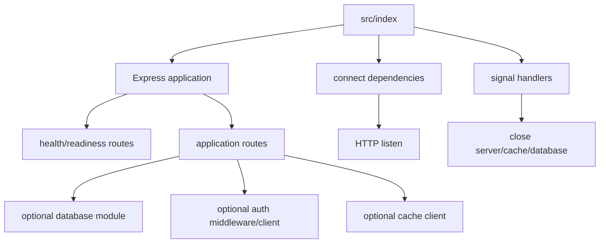
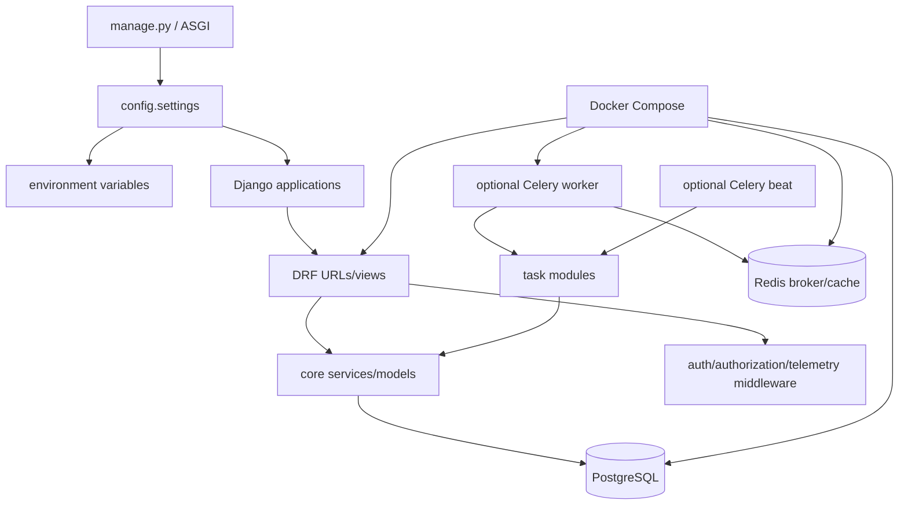
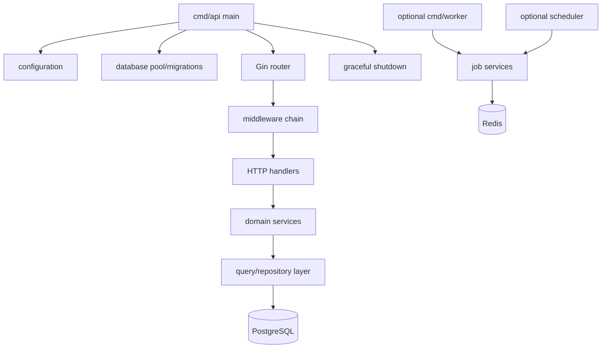
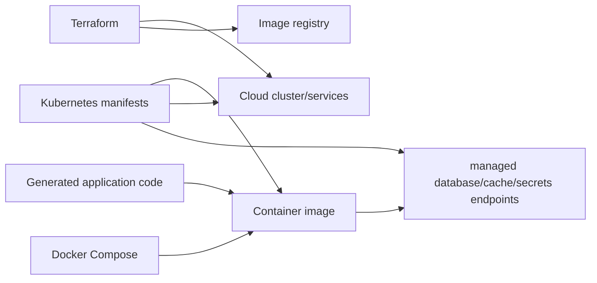

# How generated backend code ties together

This page traces runtime relationships inside generated outputs. Praxis itself is not present at runtime.

## Standard Express backend

The base backend owns process lifecycle. Database/cache modules patch imports, startup readiness, example routes, and shutdown hooks into stable anchors. Authentication adds middleware/client setup appropriate to self-hosted, Clerk, or Supabase. Docker adds matching services and internal environment URLs.

Important invariant: dependency readiness occurs before the server announces readiness; shutdown stops accepting traffic before closing shared clients.

## Django/DRF Pro backend

`pro.django` establishes project settings, URL routing, database configuration, migrations, health behavior, container files, and tests. Capability overlays add focused modules under the generated `core`/configuration packages. `pro.compose` adds only services required by resolved capabilities and wires them with health-conditioned dependencies.

Example request path with JWT and fine-grained authorization:

1. ASGI/Uvicorn receives the request.
2. Django middleware establishes request context and telemetry.
3. JWT authentication validates the token and creates an authenticated principal.
4. authorization policy evaluates the principal/resource/action.
5. the DRF view invokes domain/service code.
6. ORM work is committed/rolled back by Django transaction semantics.
7. audit/telemetry hooks record the outcome when selected.

## Go/Gin Pro backend

`pro.gin` provides explicit constructor wiring in the API entry point. Capability patches add imports, clients, middleware, routes, and shutdown closers at named anchors. This is compile-time wiring: generated Go code directly owns the selected integrations; there is no plugin loader at runtime.

Example request path:

1. `cmd/api` loads validated environment configuration and dependencies.
2. Gin routes the request through recovery, request ID, logging, and selected auth/telemetry middleware.
3. a handler validates HTTP input and calls a service.
4. the service applies domain policy and calls typed database/integration interfaces.
5. the handler maps the result to an HTTP response.
6. signal handling drains the server before closing clients/pools.

## Infrastructure joins the application

Compose is developer/local production-shape wiring. Kubernetes expresses workload-level concerns. Terraform creates selected cloud foundations and managed services. They are related outputs but separate lifecycle tools; Terraform does not execute application migrations, and application code does not create cloud resources.

## Finding the exact generated file

1. Read `praxis.config.json` in the output.
2. Reproduce `resolveModules(config)` using [`cli/src/config/resolver.ts`](../cli/src/config/resolver.ts).
3. For each selected module, inspect matching entries in its `manifest.json`.
4. Follow the overlay `source` and output `scope`.
5. Search patches for the target file/anchor.
6. Confirm with the relevant generator test rather than relying on filenames alone.

Useful tests: [`cli/tests/generator/lifecycle.test.ts`](../cli/tests/generator/lifecycle.test.ts), [`cli/tests/generator/proRuntime.test.ts`](../cli/tests/generator/proRuntime.test.ts), and [`cli/tests/generator/proCapabilities.test.ts`](../cli/tests/generator/proCapabilities.test.ts).

