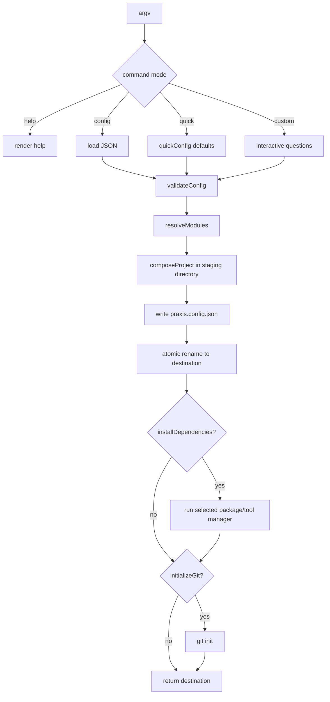

# Generation pipeline

## End-to-end sequence



## 1. Command parsing

The parser accepts the canonical no-subcommand form and the compatibility `create` alias. It resolves help, project name, quick/config modes, and `--no-install` without prompting. Invalid combinations fail before the workflow begins.

Authoritative code: [`cli/src/cli/command.ts`](../cli/src/cli/command.ts).

## 2. Configuration acquisition

- **Custom:** `runCreate` asks project type, language/framework, UI mode, backend choices, deployment targets, package manager, installation, and Git questions in dependency order.
- **Quick:** `quickConfig` produces recommended fullstack defaults without introducing an unexpected cache.
- **Config:** `loadConfigFile` parses JSON; an optional command-line project name overrides the file name; `--no-install` can only reduce installation behavior.

Angular is TypeScript-only. If selected after JavaScript, the workflow makes the constraint explicit and lets the user switch language or reselect a framework.

## 3. Validation

Validation is strict:

- safe destination names only;
- exact known keys;
- project-type-specific presence/absence rules;
- supported framework, database, auth, cache, and deployment values;
- valid UI style IDs;
- Pro stack/capability/cloud consistency;
- required booleans.

The resolver calls validation again, so programmatic callers cannot bypass the boundary.

## 4. Module resolution

Resolution produces order, not a set. For a standard fullstack example:

```text
base.workspace
frontend.next
styling.tailwind-shadcn
ui.apple
backend.express
database.postgres
auth.self-hosted
cache.redis
deployment.vercel
deployment.docker
```

Later modules may intentionally replace starter files or patch anchors introduced earlier. Changing order is therefore a behavior change.

For Pro, the order is base → stack → capabilities → Compose → Kubernetes → shared Terraform → cloud Terraform.

## 5. Composition transaction

The composer rejects an existing destination, creates a sibling temporary directory, loads all selected manifests, and applies:

1. matching overlays in module order;
2. matching patches in module order;
3. merged package contributions;
4. merged environment keys;
5. `praxis.config.json`.

It then renames staging to the final destination. On any error, staging is recursively removed. Because the temporary directory is beside the destination, the rename remains on the same filesystem and is atomic under normal filesystem semantics.

## 6. Post-generation operations

Dependency installation and Git initialization occur after composition. Standard projects use the selected JavaScript package manager. Pro projects use PDM for Django or Go modules for Gin. Failure here can leave an already composed destination for diagnosis; the atomicity guarantee specifically covers composition.

## Failure table

| Failure | Result |
| --- | --- |
| Invalid arguments/config | No destination or staging directory |
| Missing/invalid manifest | Staging removed; destination absent |
| Overlay escapes module/output root | Staging removed; destination absent |
| Patch anchor missing/ambiguous | Staging removed; destination absent |
| Existing destination | Rejected without modification |
| Dependency installation fails | Composed destination remains; error returned |
| Git initialization fails | Composed destination remains; error returned |

