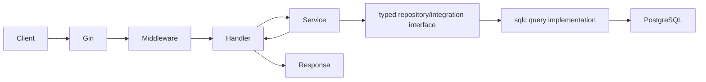

# Go and Gin Praxis Pro architecture

The Go stack uses explicit compile-time dependency wiring. It is not a classical inheritance architecture: structs hold dependencies, interfaces define boundaries, constructors assemble implementations, Gin handlers own HTTP transport, services own policy, and query/repository code owns persistence.

## Generated directory map

```text
cmd/api/main.go
cmd/worker/            # when selected
internal/
  config/
  database/
  httpserver/
  ...selected services/integrations
db/
  migrations/
  queries/
openapi/openapi.yaml
go.mod
sqlc.yaml
Dockerfile
docker-compose.yml
k8s/                   # when selected
infra/terraform/       # when selected
```

## Runtime entry points

`cmd/api/main.go` loads configuration, constructs pools/clients/services, creates the Gin router, starts HTTP, and coordinates signals. Capability modules may add `cmd/worker` or scheduler commands. SQL migrations and sqlc queries form the persistence boundary.

## Request lifecycle



Recovery, request ID, structured logging, and selected auth/telemetry middleware run before handlers. Handlers validate/map transport data, services apply domain policy, and typed interfaces isolate persistence/integration details.

## Dependency wiring

Praxis patches named anchors in `cmd/api/main.go` and router construction. Generated constructors create selected clients and pass them explicitly; there is no reflection-based container or runtime plugin discovery. Capability closure ensures prerequisites such as Redis are constructed before workers/realtime features that use them.

## Startup, readiness, and shutdown

Configuration and dependencies are validated before the HTTP listener becomes ready. Database migrations remain an explicit operational step. Signal handling drains the HTTP server with a deadline, then closes workers, clients, and pools. Separate worker/scheduler commands own separate signal lifecycles in Compose/Kubernetes.

## Capability integration

JWT middleware authenticates requests; policy services implement fine-grained authorization. Redis, jobs, schedules, storage, search, Kafka, realtime, flags, observability, resilience, and infrastructure capabilities add typed packages and constructor wiring. Compile failures expose incomplete wiring early.

## Infrastructure relationship

Compose includes API, PostgreSQL, and selected supporting services/commands. Kubernetes defines independent API, worker, scheduler, migration, and dependency workloads. Terraform creates cloud infrastructure selected for the same resolved capabilities but does not compile Go, apply migrations, or apply Kubernetes resources.

## Extension points

Add handlers through the router, keep business policy in services, define narrow interfaces at their consumer, generate query implementations with sqlc, and wire dependencies in entry points. Template changes must keep constructors, shutdown ownership, Compose services, probes, and tests consistent.

## Authoritative sources and tests

- Stack: [`cli/templates/pro.gin/`](../cli/templates/pro.gin/)
- Core: [`cli/templates/pro.core/`](../cli/templates/pro.core/)
- Capability examples: [`cli/templates/pro.capability.jwt-auth/`](../cli/templates/pro.capability.jwt-auth/), [`pro.capability.redis-cache/`](../cli/templates/pro.capability.redis-cache/)
- Runtime contracts: [`cli/tests/generator/proRuntime.test.ts`](../cli/tests/generator/proRuntime.test.ts)
- Capability contracts: [`cli/tests/generator/proCapabilities.test.ts`](../cli/tests/generator/proCapabilities.test.ts)
