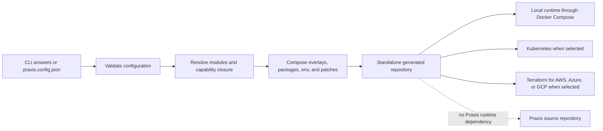

# Praxis documentation

Praxis turns an explicit project decision into an inspectable, standalone repository. The `praxiflow` CLI validates a typed configuration, resolves composable modules, and applies their files and integrations atomically. The result owns its runtime: Praxis is not a runtime dependency of generated applications.

Markdown in `docs/` is the source of truth for the [Praxis GitHub Wiki](https://github.com/sidhxntt/Praxis/wiki).

## The mental model

The configuration is the intent record. The resolver decides which modules participate. Manifests describe conditional contributions. The composer writes into a staging directory and promotes it only after composition succeeds. Generated code then runs independently using its framework-native architecture.

## Two documentation domains

### [Praxis Core Internals](core-internals.md)

Read this when changing Praxis itself. It covers the repository, CLI, schemas, resolver, capability closure, manifests, composer, UI authoring pipeline, tests, and Wiki publication.

### [Praxis Template Architecture](template-architecture.md)

Read this when working in or changing generated applications. It covers Standard frontend/Express/fullstack outputs, Django/DRF and Go/Gin Praxis Pro stacks, capability wiring, Docker Compose, Kubernetes, and Terraform.

The boundary matters: Core explains **how Praxis decides and writes**; Templates explain **how the written application runs**.

## Standard Praxis and Praxis Pro

| | Standard Praxis | Praxis Pro |
| --- | --- | --- |
| Primary use | Frontend, Express backend, or fullstack scaffolding | Production-oriented backend foundation |
| Backends | Express with TypeScript or JavaScript | Django/DRF or Go/Gin |
| Selection | Framework, database, auth, cache, deployment, UI | Stack plus requested/resolved operational capabilities |
| Local topology | Docker when selected | Docker Compose always supplies the local production shape |
| Cluster/cloud | Standard deployment modules | Kubernetes and AWS/Azure/GCP Terraform when selected |
| Architecture guide | [Standard projects](standard-projects.md) | [Praxis Pro](praxis-pro.md) |

## Choose your path

- **Evaluating Praxis:** [Overview](overview.md) → [System architecture](architecture.md) → [Standard projects](standard-projects.md) or [Praxis Pro](praxis-pro.md).
- **Using a generated repository:** [Template architecture](template-architecture.md) → choose the generated stack → [extension guide](extending-generated-projects.md).
- **Changing the generator:** [Core internals](core-internals.md) → [code architecture](code-architecture.md) → [generation pipeline](generation-pipeline.md) → [testing](testing.md).
- **Codex or Claude Code working on templates:** start with the [Template Agent Guide](template-agent-guide.md), then resolve the exact context bundle.
- **Publishing documentation:** [Wiki publishing](wiki-publishing.md).

## Accuracy contract

- Pages describe implemented behavior and link to authoritative source or contract tests.
- A template directory existing does not mean every project selects it; `resolveModules` and manifest selectors decide output.
- Requested Praxis Pro capabilities and resolved capabilities are distinct.
- Docker Compose, Kubernetes, and Terraform are related outputs with different lifecycle ownership.
- The Wiki routes understanding; source and executable tests remain the final evidence.
