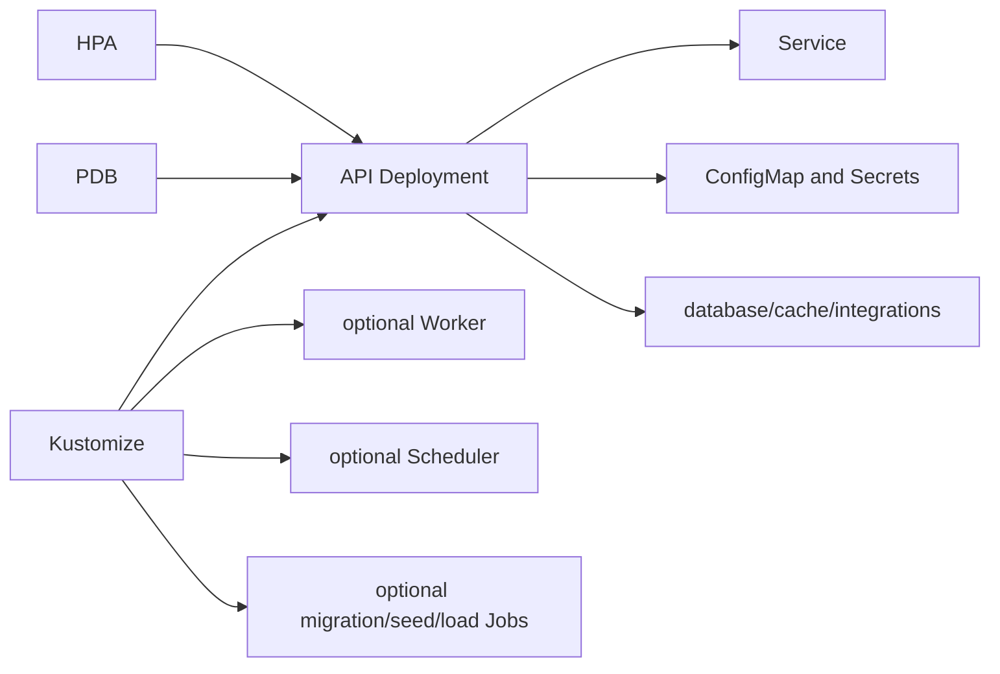

# Kubernetes architecture

Kubernetes output is selected through the Praxis Pro `kubernetes` capability or implied by Terraform. It expresses workload-level deployment concerns for the chosen stack and resolved capabilities.

## Base resources

The base includes namespace, service account, API Service/Deployment, ConfigMap, network policy, PostgreSQL, and Kustomize assembly. Django and Go overlays provide stack-specific commands, probes, configuration, and migrations.

## Capability resources

- background jobs add a worker Deployment;
- scheduled jobs add a scheduler workload;
- seed and load testing add explicit tool Jobs;
- Redis, search, object storage, Prometheus, OpenTelemetry, ELK, and synthetic monitoring add their services/configuration;
- autoscaling adds an HPA;
- high availability adds a PodDisruptionBudget;
- cloud secrets adds an ExternalSecret contract;
- Nginx adds traffic-facing resources.

## Probes and shutdown

Liveness detects a stuck process; readiness prevents traffic before dependencies are usable. Termination grace and application signal handling must agree so requests drain before clients/pools close. Workers and schedulers have independent probes and termination behavior.

## Cloud relationship

Terraform may provision a cluster, registry, networking, managed database/cache/storage/search, and secret backends. Kubernetes manifests deploy workloads into that foundation and reference endpoints/credentials supplied through deployment configuration. Terraform does not automatically apply Kustomize, and Kubernetes does not own cloud resource creation.

## Authoritative sources and tests

- Module: [`cli/templates/pro.kubernetes/`](../cli/templates/pro.kubernetes/)
- Capability closure: [`cli/src/config/pro.ts`](../cli/src/config/pro.ts)
- Matrix: [`cli/tests/generator/proMatrix.test.ts`](../cli/tests/generator/proMatrix.test.ts)
