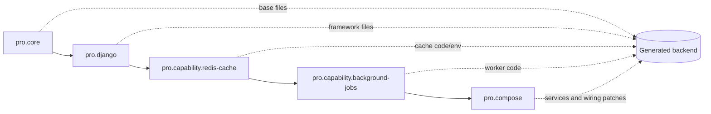

# Manifest composition system

Every composable module lives at `cli/templates/<module-id>/manifest.json`. The manifest is data, not executable code.

## Schema

```ts
interface TemplateManifest {
  id: string;
  overlays?: OverlayDefinition[];
  packages?: PackageContribution[];
  env?: EnvironmentContribution[];
  patches?: PatchDefinition[];
}
```

See [`cli/src/composer/manifest.ts`](../cli/src/composer/manifest.ts) for the authoritative types and [`cli/src/composer/compose.ts`](../cli/src/composer/compose.ts) for semantics.

## Selectors

A contribution may constrain any of:

| Selector | Values |
| --- | --- |
| `language` | `typescript`, `javascript` |
| `framework` | `next`, `vite`, `vue`, `astro`, `angular` |
| `projectType` | `frontend`, `backend`, `fullstack`, `pro-backend` |
| `cache` | `redis`, `memcached`, `none` |
| `proStack` | `python-django`, `go-gin` |
| `capability` | One canonical Pro capability |
| `cloud` | `aws`, `azure`, `gcp` |

Selectors use AND semantics: every specified field must match. An omitted selector is unconstrained. A `capability` selector matches resolved Pro capabilities, not only the user's requested list.

## Output scopes

| Scope | Frontend project | Backend project | Fullstack project | Pro backend |
| --- | --- | --- | --- | --- |
| `root` | output root | output root | output root | output root |
| `frontend` | output root | invalid/unselected | `frontend/` | invalid/unselected |
| `backend` | invalid/unselected | output root | `backend/` | output root when used |

Scope keeps the same module portable between standalone and fullstack layouts.

## Overlays

An overlay copies a module-local directory into its resolved output scope. Paths are confined; absolute paths and traversal outside the module/output are rejected. By default, copying over an existing file is an error. `replace: true` makes replacement explicit—used by UI styles to replace a framework starter page.

Tokens are replaced in text file contents and supported path segments during copy. Binary assets pass through unchanged.

## Package contributions

Contributions merge `dependencies`, `devDependencies`, and `scripts` into the `package.json` in their scope. Conflicting versions or script definitions are rejected rather than silently choosing one. This makes incompatible modules fail visibly.

## Environment contributions

Environment keys are accumulated per scope and written to `.env.example`; no real secret values are generated. Duplicate keys are deduplicated. Generated applications copy this file to `.env` during setup.

## Patches

Patches apply exact string replacement to an existing text file:

```json
{
  "scope": "root",
  "file": "docker-compose.yml",
  "find": "  # @praxis:services",
  "replace": "  redis:\n    image: redis:8.8-alpine\n  # @praxis:services",
  "capability": "redis-cache"
}
```

Anchors are deliberately preserved in replacement text when later capabilities must patch the same location. A target must exist exactly once; missing or ambiguous targets fail composition. Patch ordering follows module and array order.

## Module interaction example



`background-jobs` implies `redis-cache`, so the Redis module appears before the jobs module. Stack-specific overlays provide Celery for Django and a Go worker implementation for Gin. `pro.compose` sees the effective capabilities and patches the appropriate services into the stack's base Compose file.

## Adding a module safely

1. Choose a stable, lowercase dotted ID and matching directory name.
2. Add minimal overlays with explicit selectors.
3. Prefer anchors owned by a base/stack module; preserve reusable anchors.
4. Declare package/env changes in the manifest rather than editing unrelated modules.
5. Add resolver selection or capability registration.
6. Test positive output, negative absence, conflicts, and package contents.
7. Update this Wiki when behavior or extension rules change.

