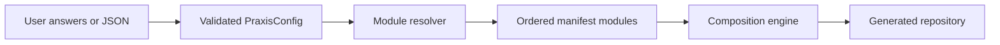
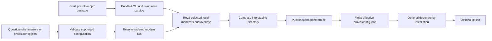

# What Praxis is

Praxis Flow is an interactive and configuration-driven CLI for producing complete application repositories. It replaces a collection of branch-specific starters with one validated configuration model and one composable template engine.

Praxis has two generation families:

- **Standard Praxis Flow** generates frontend, backend, or fullstack JavaScript/TypeScript projects. Frontends may use Next.js, Vite React, Vue, Astro, or Angular; standard backends use Express.
- **Praxis Pro** is a project type inside the same CLI. It generates a production-oriented backend using Python with Django/DRF or Go with Gin, plus selected operational capabilities.

The repository also contains `web/`, the public Praxis website. The website explains the product; it does not run generation and is not shipped in the `praxiflow` npm package.

## The central idea

Praxis separates **intent** from **implementation**:

The configuration says what the user wants. The resolver converts that intent into module identifiers. Each module manifest declares conditional file overlays, package contributions, environment keys, and text patches. The composer applies those declarations in order inside a temporary directory and publishes the destination only after composition succeeds.

## How a configuration becomes a project

Earlier Praxis starters were obtained by cloning a Git branch for a selected combination. A branch name represented a whole preassembled template, such as a language plus framework or database. That approach made every supported combination a separate Git artifact.

Current Praxis does **not** download a template branch while generating a project. The `praxiflow` npm package includes the CLI and its maintained `templates/` catalog. The questionnaire produces a configuration in memory, or `praxiflow --config praxis.config.json` loads one from disk. The CLI then follows this chain:

For example, a TypeScript, Next.js, Express, PostgreSQL, self-hosted-authentication, Redis, Docker project resolves to independent modules for the workspace, frontend, backend, database, authentication, cache, and Docker deployment. It is not fetched from a branch named for that full combination.

Each selected module has a `manifest.json`. Its selectors determine which overlays apply for the configuration; its declarations can add source files, package dependencies and scripts, `.env.example` keys, and narrowly targeted integration patches. The composer processes those modules in resolver order, fails on an undeclared file conflict or missing patch anchor, and only renames the complete staging directory to the destination after successful composition. The generated repository receives the effective `praxis.config.json`, so its provenance and the selected options are inspectable and reproducible.

Only after the source tree exists does Praxis optionally contact external systems: it runs the selected package manager to install dependencies and can run `git init` in the new project. Those steps are separate from template selection; neither Git nor a remote template branch supplies the generated files.

## What Praxis generates

| Project type | Frontend | Backend | Typical root layout |
| --- | --- | --- | --- |
| `frontend` | Selected framework | None | frontend files at root |
| `backend` | None | Express | backend files at root |
| `fullstack` | Selected framework | Express | `frontend/` and `backend/` |
| `pro-backend` | None | Django/DRF or Gin | production backend at root |

This distinction matters: not every template choice produces a backend. “Template” can also mean a UI style module, deployment module, database module, or capability overlay. See [Terminology](terminology.md).

Use [Praxis Core Internals](core-internals.md) for how the generator is implemented. Use [Praxis Template Architecture](template-architecture.md) for how generated code and infrastructure work together.

## Determinism and provenance

For a fixed Praxis version and a validated configuration, module resolution and composition are deterministic. Every output receives `praxis.config.json`, which records the effective selection. UI template outputs also receive the selected `DESIGN.md`. Pro outputs record both requested and implied capabilities.

Determinism does not mean dependency registries or external installers are immutable. Praxis pins or constrains generated dependencies, but `installDependencies` and package-manager behavior still involve external systems after the source tree has been composed.

## Product boundaries

Praxis is:

- a source generator;
- a catalog of maintained implementation modules;
- an offline UI preview gallery;
- a validator for supported combinations;
- an opinionated production-backend starting point.

Praxis is not:

- a hosted application builder or control plane;
- a runtime framework required by generated projects;
- a dashboard/form generator—the 40 UI styles are landing pages;
- a claim that every optional Pro capability is appropriate without review;
- a replacement for an application's own threat model, load testing, or operations review.

## Authoritative sources

- CLI entry and command routing: [`cli/src/index.ts`](../cli/src/index.ts), [`cli/src/cli/run.ts`](../cli/src/cli/run.ts)
- Configuration model: [`cli/src/config/schema.ts`](../cli/src/config/schema.ts)
- Module resolution: [`cli/src/config/resolver.ts`](../cli/src/config/resolver.ts)
- Composition: [`cli/src/composer/compose.ts`](../cli/src/composer/compose.ts)
- Legacy branch clone implementation: [`cli/src/controllers/cloneRepo.ts`](../cli/src/controllers/cloneRepo.ts)
- Public website: [`web/`](../web/)
