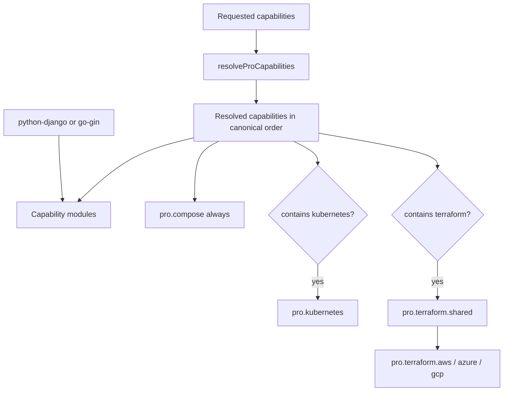

# Praxis Pro architecture

Praxis Pro is the `pro-backend` project type in the normal `praxiflow` CLI. It is not a separate branch or executable. Schema version 2 records a backend stack, requested capabilities, resolved capabilities, and an optional Terraform cloud.

## Resolution model

Capabilities express outcomes, not vendor questionnaires. Stack-specific selectors choose the implementation—for example Celery in Django versus a Go worker—without changing the capability name.

## Capability implications

| Requested | Implied prerequisites |
| --- | --- |
| `fine-grained-auth` | `jwt-auth` |
| `background-jobs` | `redis-cache` |
| `scheduled-jobs` | `background-jobs` → `redis-cache` |
| `email-tasks` | `background-jobs` → `redis-cache` |
| `realtime` | `redis-cache` |
| `synthetic-monitoring` | `prometheus` |
| `terraform` | Kubernetes, autoscaling, high availability, edge protection, database resilience, cloud secrets |

The exact implication graph and canonical order are in [`cli/src/config/pro.ts`](../cli/src/config/pro.ts). `resolvedCapabilities` is verified rather than trusted.

## Composition order

1. `pro.core` — shared repository/operations baseline.
2. `pro.django` or `pro.gin` — application framework and database lifecycle.
3. `pro.capability.<name>` for each resolved capability.
4. `pro.compose` — local production-shaped service topology for the effective set.
5. `pro.kubernetes` when selected/implied.
6. shared and cloud-specific Terraform when selected.

Compose is always generated for local operation. Kubernetes and Terraform are opt-in; Terraform implies Kubernetes and requires AWS, Azure, or GCP.

## Output layers

| Layer | Django/DRF | Go/Gin |
| --- | --- | --- |
| HTTP API | Django + Django REST Framework | Gin router/handlers |
| Persistence | PostgreSQL via Django ORM/migrations | PostgreSQL via migrations and typed query/service code |
| Settings | environment-split Django settings | environment/config package |
| Health | liveness/readiness/startup-aware endpoints | liveness/readiness handlers |
| Worker | Celery when selected | generated Go worker when selected |
| Scheduler | Celery beat when selected | generated Go scheduler when selected |
| Local topology | Docker Compose | Docker Compose |
| Orchestration | optional Kubernetes | optional Kubernetes |
| Cloud baseline | optional Terraform | optional Terraform |

## Operational capabilities

Capabilities can contribute application code, service configuration, infrastructure, or a combination:

- authentication/authorization patch request middleware and domain code;
- Redis, jobs, email, realtime, Kafka, search, and storage add clients plus local services;
- Sentry, Prometheus, OpenTelemetry, ELK, and synthetic monitoring add instrumentation and operational services;
- Nginx, autoscaling, high availability, edge protection, resilience, disaster recovery, and secrets primarily affect deployment/runtime artifacts;
- compliance audit, seed data, load testing, and feature flags add explicit operational tools or APIs.

## Honest boundary

Praxis Pro produces a strong starting repository and executable operational wiring. It cannot prove that a generated application is production-ready for a particular organization. Users still own secret provisioning, cloud account policy, data classification, capacity planning, restore drills, penetration testing, and framework dependency maintenance.

## Authoritative sources

- Pro model: [`cli/src/config/pro.ts`](../cli/src/config/pro.ts)
- Pro validation: [`cli/src/config/schema.ts`](../cli/src/config/schema.ts)
- Resolver: [`cli/src/config/resolver.ts`](../cli/src/config/resolver.ts)
- Core/stack manifests: [`cli/templates/pro.core/`](../cli/templates/pro.core/), [`cli/templates/pro.django/`](../cli/templates/pro.django/), [`cli/templates/pro.gin/`](../cli/templates/pro.gin/)
- Release matrix: [`cli/tests/generator/proMatrix.test.ts`](../cli/tests/generator/proMatrix.test.ts)

