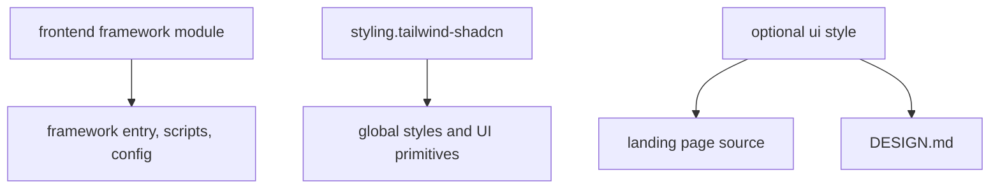

# Standard frontend architecture

Standard frontend modules generate framework-native applications for Next.js, Vite/React, Vue, Astro, or Angular. Tailwind and shadcn/ui are always the styling system; a selected landing-page style adds native source plus `DESIGN.md`.

## Ownership

Frontend-only outputs write at the repository root. Fullstack outputs write under `frontend/` through manifest scope mapping. Frontend modules do not own backend clients, databases, authentication servers, or caches.

## Runtime boundaries

- Next.js owns App Router layout/page boundaries.
- Vite owns the React client entry and build configuration.
- Vue owns its application mount and single-file components.
- Astro owns page/layout islands and build configuration.
- Angular is TypeScript-only and owns its application bootstrap/component tree.

Generated UI styles are source, not screenshots embedded at runtime. Preview images belong to the Praxis authoring/selection pipeline and are excluded from generated packages.

## Integration

In a fullstack workspace the root scripts coordinate independent frontend/backend packages. The frontend talks to the backend through an environment-defined HTTP boundary; it does not import backend source. Docker publishes the frontend and backend as separate services when selected.

## Authoritative sources and tests

- Framework modules: [`cli/templates/frontend.next/`](../cli/templates/frontend.next/), [`frontend.vite/`](../cli/templates/frontend.vite/), [`frontend.vue/`](../cli/templates/frontend.vue/), [`frontend.astro/`](../cli/templates/frontend.astro/), [`frontend.angular/`](../cli/templates/frontend.angular/)
- Styling: [`cli/templates/styling.tailwind-shadcn/`](../cli/templates/styling.tailwind-shadcn/)
- UI architecture: [UI templates](ui-templates.md)
- Matrix contracts: [`cli/tests/generator/matrix.test.ts`](../cli/tests/generator/matrix.test.ts)
