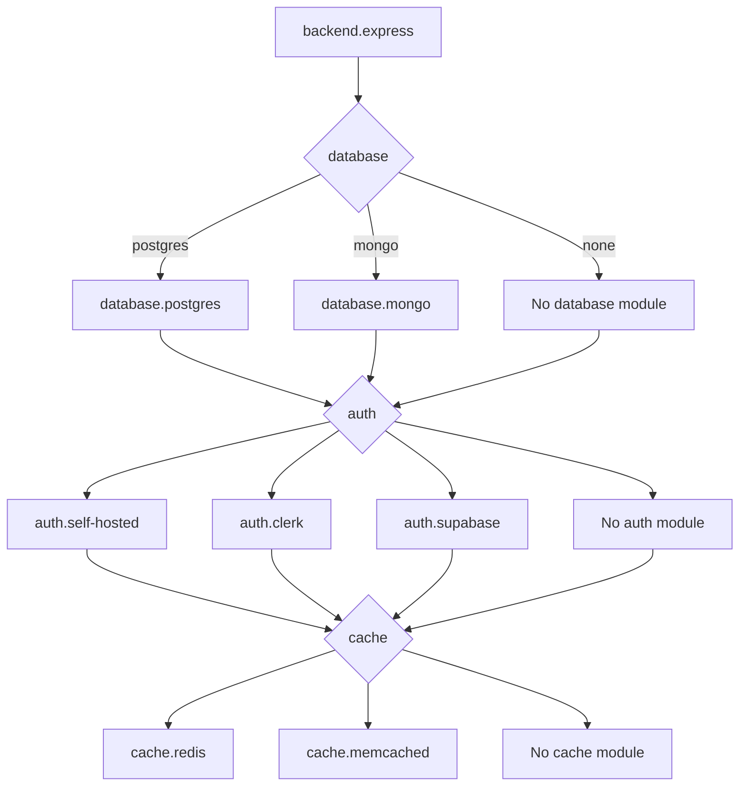
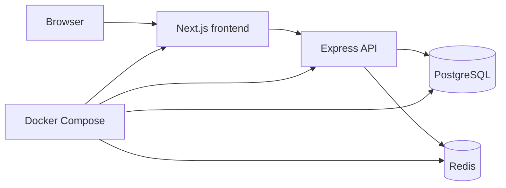

# Standard Praxis projects

Standard schema-version-1 projects compose frontend, Express backend, and deployment modules according to `projectType`.

## Project families

### Frontend

Selected modules:

```text
frontend.<framework>
styling.tailwind-shadcn
[ui.<style>]
deployment.<target>...
```

The files are written at the project root. No backend, database, auth, or cache module is selected.

### Backend

Selected modules:

```text
backend.express
[database.<provider>]
[auth.<provider>]
[cache.<provider>]
deployment.<target>...
```

The backend is written at the project root. Vercel is rejected for backend-only projects by the current compatibility rules.

### Fullstack

Selected modules:

```text
base.workspace
frontend.<framework>
styling.tailwind-shadcn
[ui.<style>]
backend.express
[database.<provider>]
[auth.<provider>]
[cache.<provider>]
deployment.<target>...
```

`base.workspace` establishes `frontend/` and `backend/` package boundaries and root scripts. Scope mapping sends frontend/backend contributions to the corresponding directory.

## Standard backend composition

`backend.express` supplies the server lifecycle, health endpoint, package scripts, and environment baseline. Optional modules layer on behavior:



Self-hosted authentication requires a database. External auth providers can be selected without a local database because identity storage is external.

## Deployment modules

Deployment targets are independent modules and may be combined when compatible:

- `deployment.vercel` contributes frontend deployment configuration.
- `deployment.railway` and `deployment.render` require a backend.
- `deployment.docker` patches the generated topology according to project type, database, and cache.

Deployment modules consume the same configuration selectors as application modules; they do not rediscover the project by scanning files.

## Example: fullstack Next + Express + PostgreSQL + Redis



The frontend and backend remain separate packages. Database and cache clients are backend-scoped. Docker patches internal service URLs into the backend environment while `.env.example` documents developer-facing values.

## Authoritative sources

- Selection rules: [`cli/src/config/resolver.ts`](../cli/src/config/resolver.ts)
- Configuration compatibility: [`cli/src/config/schema.ts`](../cli/src/config/schema.ts)
- Standard manifests: [`cli/templates/backend.express/`](../cli/templates/backend.express/), [`cli/templates/database.postgres/`](../cli/templates/database.postgres/), [`cli/templates/deployment.docker/`](../cli/templates/deployment.docker/)
- Matrix tests: [`cli/tests/generator/matrix.test.ts`](../cli/tests/generator/matrix.test.ts)

