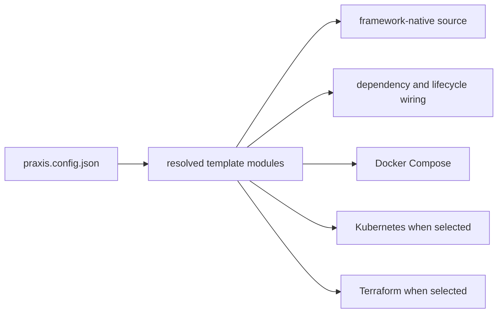

# Praxis Template Architecture

Template Architecture documents the repositories Praxis produces: file ownership, framework entry points, request flow, dependency construction, capability integration, process lifecycle, and infrastructure topology.

## Standard Praxis

- [Standard frontend architecture](standard-frontend-architecture.md)
- [Express backend architecture](express-architecture.md)
- [Fullstack workspace architecture](fullstack-architecture.md)
- [Docker Compose architecture](compose-architecture.md)

Standard projects compose independent frontend, backend, integration, and deployment modules. Express integration is functional and uses stable lifecycle/route anchors; it is not a class hierarchy.

## Praxis Pro

- [Django/DRF architecture](django-architecture.md)
- [Go/Gin architecture](gin-architecture.md)
- [Capability architecture](capability-architecture.md)
- [Docker Compose architecture](compose-architecture.md)
- [Kubernetes architecture](kubernetes-architecture.md)
- [Terraform architecture](terraform-architecture.md)

Praxis Pro always generates a backend stack and local Compose topology. Selected capabilities add framework-specific application code and may add Compose, Kubernetes, or Terraform resources. Terraform requires a chosen cloud.

## Working safely

Use [Extending generated projects](extending-generated-projects.md) when modifying an output. Agents changing templates must start with the [Template Agent Guide](template-agent-guide.md) and load the bounded context returned by `scripts/resolve-template-context.mjs`.

## Generator boundary

Template modules are selected and composed by Praxis Core, but the output runs without Praxis. To understand selection or patch mechanics, use [Core Internals](core-internals.md); to understand runtime behavior, remain in this domain.
