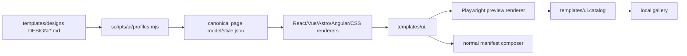

# UI template architecture

Praxis contains 40 original, multi-section landing-page directions. Each style supports nine valid framework/language targets:

- Next.js JavaScript and TypeScript
- Vite React JavaScript and TypeScript
- Vue JavaScript and TypeScript
- Astro JavaScript and TypeScript
- Angular TypeScript

Angular JavaScript is intentionally unsupported.

## Authoring pipeline



The authoring scripts normalize design intent into a canonical landing-page structure, then emit native framework source. The committed UI modules and screenshots are generated artifacts verified against the authoring pipeline.

## Runtime selection

After framework selection, the CLI asks whether to use a landing-page template:

- **Starter:** only framework and `styling.tailwind-shadcn` modules are composed.
- **Template:** the local gallery or terminal selector returns a canonical style ID; `ui.<style>` is added after styling.

The style manifest first copies shared `DESIGN.md` and assets, then uses a framework/language-selected overlay with `replace: true` to replace the starter page and stylesheet.

## Gallery boundary

The gallery is offline and bundled:

1. a local HTTP server binds to a random `127.0.0.1` port;
2. only known gallery/catalog/preview resources are served;
3. the browser can filter, inspect desktop/mobile previews, and submit one style;
4. the waiting CLI receives and validates the selection;
5. headless/declined/failed browser flows use the terminal selector.

The gallery does not download templates or upload user data.

## Generated design provenance

Template mode copies the selected normalized guide to:

- `DESIGN.md` in frontend-only projects;
- `frontend/DESIGN.md` in fullstack projects.

This guide is for future maintainers and agents: it describes the visual system, typography, color, component language, responsive behavior, and composition decisions. Starter mode does not copy it.

## Page scope

Every style is a landing page with navigation, hero, multiple supporting sections, proof/metrics, call to action, and footer. The UI catalog does not generate dashboards, admin panels, product forms, or authenticated application screens.

## Safe modification workflow

Do not hand-edit all framework outputs. Change the canonical/profile/renderer source, regenerate, render previews, and verify:

```bash
npm --workspace cli run ui:generate
npm --workspace cli run ui:previews
npm --workspace cli run ui:verify
npm --workspace cli run ui:matrix -- --target vue-ts --install --build
```

Then run accessibility, responsive, visual, gallery, adapter, catalog, preview, and package tests. See [Testing](testing.md).

## Authoritative sources

- Catalog types and IDs: [`cli/src/ui/catalog.ts`](../cli/src/ui/catalog.ts)
- Selection: [`cli/src/ui/resolveUi.ts`](../cli/src/ui/resolveUi.ts)
- Gallery server: [`cli/src/ui/gallery.ts`](../cli/src/ui/gallery.ts)
- Canonical model: [`cli/src/ui/canonical.ts`](../cli/src/ui/canonical.ts)
- Authoring pipeline: [`cli/scripts/ui/`](../cli/scripts/ui/)
- Generated catalog: [`cli/templates/ui.catalog/`](../cli/templates/ui.catalog/)

